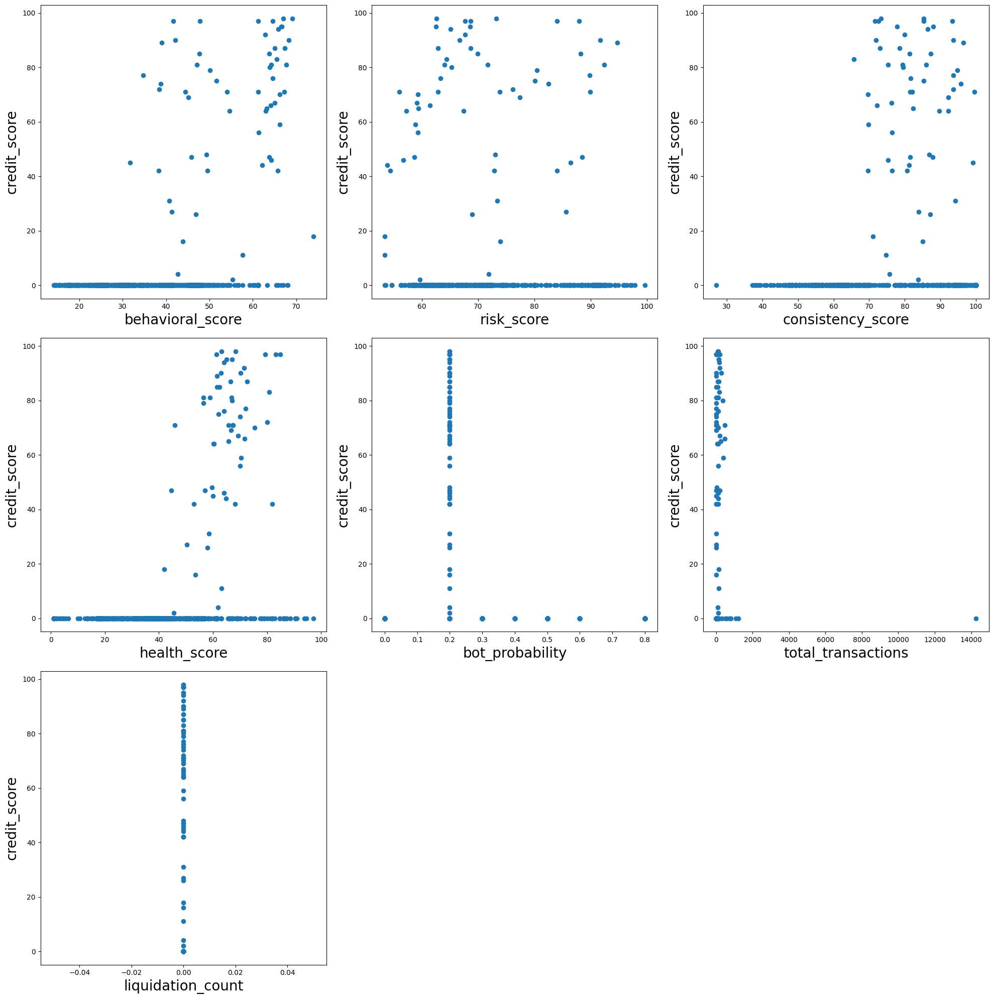
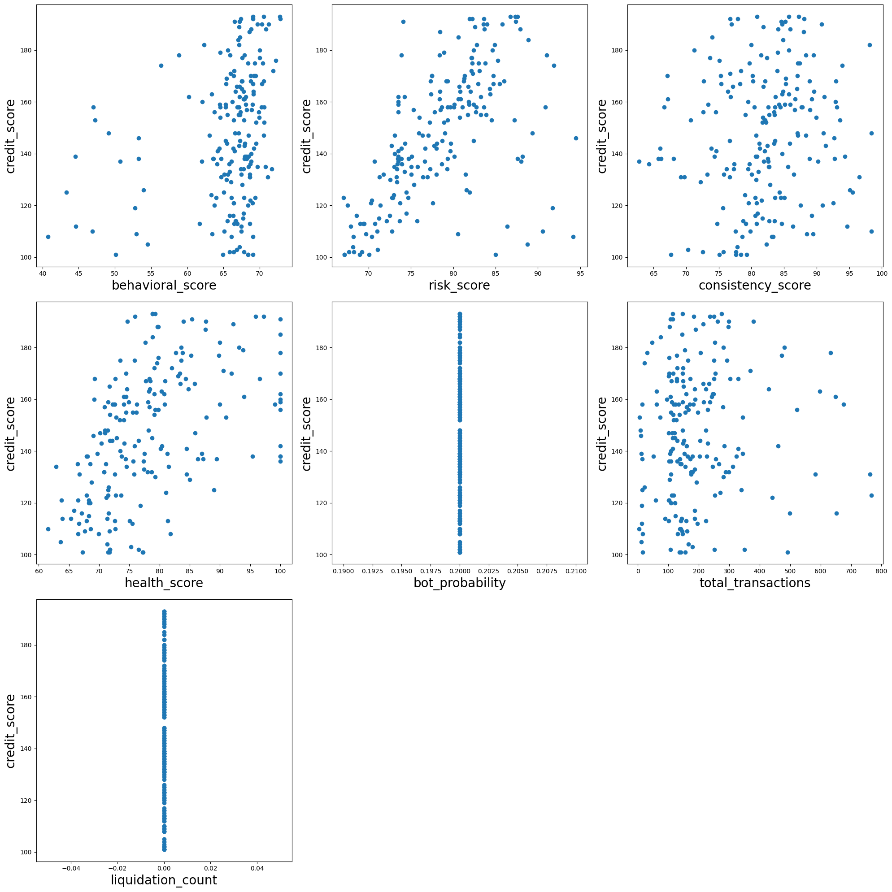
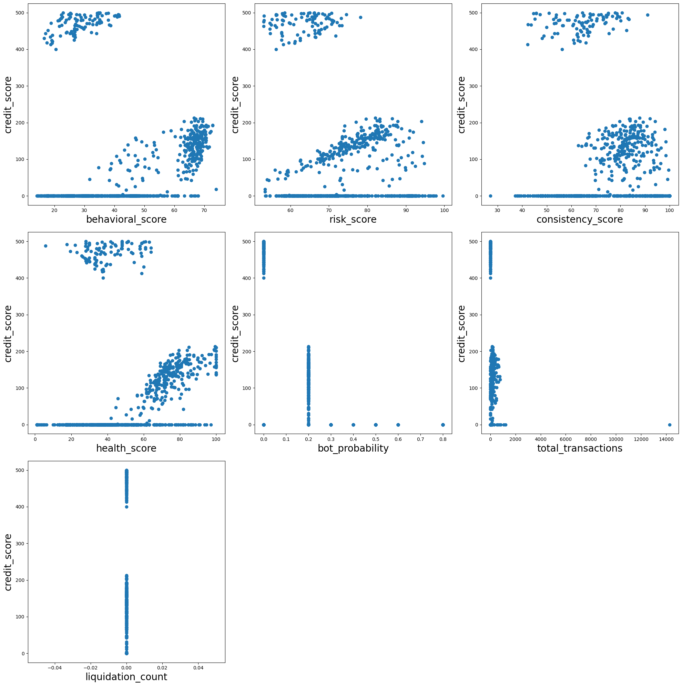
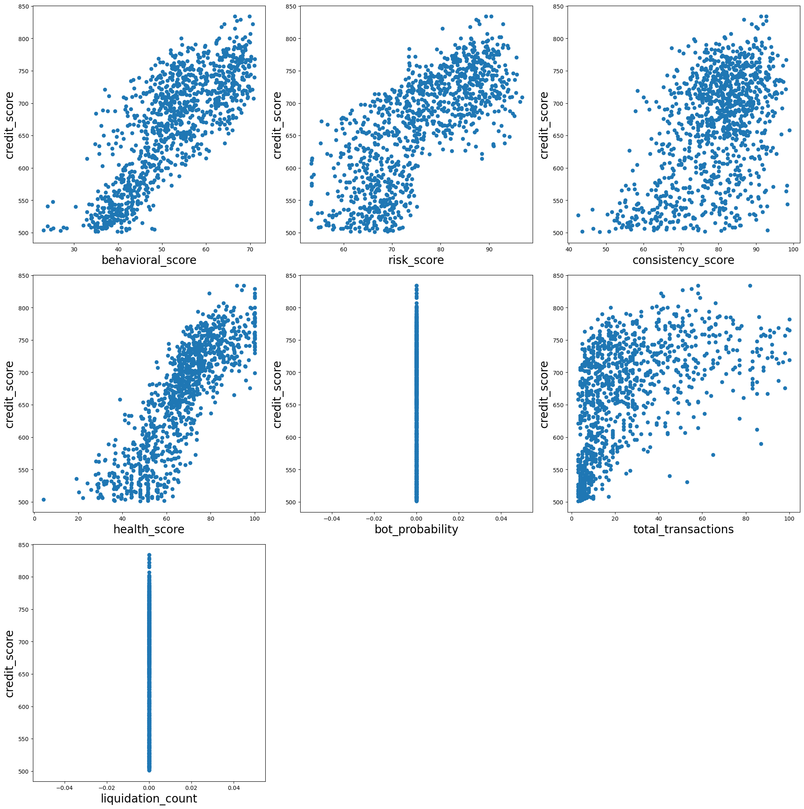

```python
import pandas as pd
import numpy as np
import matplotlib.pyplot as plt
```


```python
df = pd.read_csv('scores.csv')
```


```python
df.info()
```

    <class 'pandas.core.frame.DataFrame'>
    RangeIndex: 3497 entries, 0 to 3496
    Data columns (total 9 columns):
     #   Column              Non-Null Count  Dtype  
    ---  ------              --------------  -----  
     0   wallet_address      3497 non-null   object 
     1   behavioral_score    3497 non-null   float64
     2   risk_score          3497 non-null   float64
     3   consistency_score   3497 non-null   float64
     4   health_score        3497 non-null   float64
     5   bot_probability     3497 non-null   float64
     6   credit_score        3497 non-null   int64  
     7   total_transactions  3497 non-null   int64  
     8   liquidation_count   3497 non-null   int64  
    dtypes: float64(5), int64(3), object(1)
    memory usage: 246.0+ KB


# Wallets with score 0 - 100


```python
df1 = df[df['credit_score'] <= 100]
```


```python
fig, axes = plt.subplots(3, 3, figsize=(20, 20))
cols = ['behavioral_score', 'risk_score', 'consistency_score', 'health_score', 'bot_probability', 'total_transactions', 'liquidation_count']
axes_flat = axes.flatten()
for i, x in enumerate(cols):
    axes_flat[i].scatter(df1[x], df1['credit_score'])
    axes_flat[i].set_xlabel(x, fontsize=20)
    axes_flat[i].set_ylabel('credit_score', fontsize=20)
plt.tight_layout()
for j in range(len(cols), len(axes_flat)):
    axes_flat[j].set_visible(False)
plt.show()
```


    

    


# Wallets with score 100 - 200


```python
df2 = df[(df['credit_score'] > 100) & (df['credit_score'] <= 200)]
```


```python
fig, axes = plt.subplots(3, 3, figsize=(20, 20))
cols = ['behavioral_score', 'risk_score', 'consistency_score', 'health_score', 'bot_probability', 'total_transactions', 'liquidation_count']
axes_flat = axes.flatten()
for i, x in enumerate(cols):
    axes_flat[i].scatter(df2[x], df2['credit_score'])
    axes_flat[i].set_xlabel(x, fontsize=20)
    axes_flat[i].set_ylabel('credit_score', fontsize=20)
plt.tight_layout()
for j in range(len(cols), len(axes_flat)):
    axes_flat[j].set_visible(False)
plt.show()
```


    

    


# Wallets with score between 0 - 500


```python
df3 = df[df['credit_score'] <= 500]
fig, axes = plt.subplots(3, 3, figsize=(20, 20))
cols = ['behavioral_score', 'risk_score', 'consistency_score', 'health_score', 'bot_probability', 'total_transactions', 'liquidation_count']
axes_flat = axes.flatten()
for i, x in enumerate(cols):
    axes_flat[i].scatter(df3[x], df3['credit_score'])
    axes_flat[i].set_xlabel(x, fontsize=20)
    axes_flat[i].set_ylabel('credit_score', fontsize=20)
plt.tight_layout()
for j in range(len(cols), len(axes_flat)):
    axes_flat[j].set_visible(False)
plt.show()
```


    

    


# Wallets with score between 500 - 1000


```python
df4 = df[(df['credit_score'] > 500)]
fig, axes = plt.subplots(3, 3, figsize=(20, 20))
cols = ['behavioral_score', 'risk_score', 'consistency_score', 'health_score', 'bot_probability', 'total_transactions', 'liquidation_count']
axes_flat = axes.flatten()
for i, x in enumerate(cols):
    axes_flat[i].scatter(df4[x], df4['credit_score'])
    axes_flat[i].set_xlabel(x, fontsize=20)
    axes_flat[i].set_ylabel('credit_score', fontsize=20)
plt.tight_layout()
for j in range(len(cols), len(axes_flat)):
    axes_flat[j].set_visible(False)
plt.show()
```


    

    


```python

```
